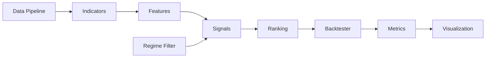

<div align="center">

# ⚡ RevertIQ

### Cross-Sectional Mean Reversion Quant Research Platform

*Institutional-grade quantitative research for Indian equity markets.*

[](https://www.python.org/downloads/)
[](https://opensource.org/licenses/MIT)
[](https://colab.research.google.com/)

</div>

---

## 🎯 What is RevertIQ?

RevertIQ is a **modular, production-quality** quantitative trading research system for **Indian stock markets** (NSE / NIFTY 50). It implements a **Cross-Sectional Mean Reversion Swing Trading** strategy with a 2–10 day holding period.

The system finds stocks that have **statistically stretched** away from their mean, ranks them by reversion probability, and generates actionable daily trade candidates — all backed by rigorous backtesting with realistic transaction costs.

### Key Capabilities

| Feature | Description |
|---------|-------------|
| 📊 **Data Pipeline** | Automated OHLCV download for NIFTY 50 via yfinance with retry logic |
| 🧮 **Feature Engineering** | 13+ technical indicators + cross-sectional features |
| 🚦 **Market Regime Filter** | Only trade in bull markets (NIFTY > 200-DMA) |
| 📡 **Signal Engine** | Multi-condition buy/sell signals with configurable thresholds |
| 🏆 **Stock Ranking** | Daily weighted composite ranking of mean reversion candidates |
| 🔬 **Backtesting** | Realistic portfolio simulation with costs, slippage, and position limits |
| 📈 **Visualization** | Professional interactive Plotly charts and HTML reports |
| ⚙️ **Walk-Forward Optimization** | Avoid overfitting with proper out-of-sample validation |

---

## 🏗️ Architecture

```
revertiq/
├── config/          # Centralized configuration (dataclasses)
├── data/            # Data pipeline (download, clean, universe)
├── indicators/      # Technical indicators (RSI, ATR, BB, Z-score)
├── features/        # Cross-sectional feature engineering
├── signals/         # Signal generation + market regime filter
├── ranking/         # Composite stock ranking engine
├── backtesting/     # Portfolio simulation + metrics + optimizer
├── portfolio/       # Position sizing + risk management
├── visualization/   # Charts + reports
└── utils/           # Logging + helpers
```



---

## 🚀 Quick Start

### Option 1: Google Colab (Recommended for beginners)

```python
# Clone and install
!git clone https://github.com/username/RevertIQ.git
%cd RevertIQ
!pip install -e .

# Run the full workflow
from revertiq.config import get_default_config
from revertiq.data import DataDownloader, DataCleaner
from revertiq.indicators import TechnicalIndicators
from revertiq.features import FeatureEngineer
from revertiq.signals import SignalGenerator, RegimeFilter
from revertiq.ranking import StockRanker
from revertiq.backtesting import BacktestEngine

# 1. Download data
config = get_default_config()
downloader = DataDownloader(config.data)
downloader.download_all()

# 2. Clean data
cleaner = DataCleaner(config.data)
stock_data = cleaner.clean_all()

# 3. Run backtest
engine = BacktestEngine(config)
result = engine.run(stock_data, signals, rankings, regime)
print(result.metrics)
```

### Option 2: Local Installation

```bash
git clone https://github.com/username/RevertIQ.git
cd RevertIQ
pip install -e .
```

---

## 📐 Strategy Overview

### Cross-Sectional Mean Reversion

The strategy exploits **short-term overreaction** in stock prices. When a stock significantly underperforms its peers (cross-sectionally), it tends to **revert to the mean** within 2–10 trading days.

### Entry Conditions (BUY when ≥3 conditions met)

| Condition | Threshold | Rationale |
|-----------|-----------|-----------|
| RSI(2) | < 10 | Extreme short-term oversold (Connors) |
| Z-score(20) | < -1.5 | 1.5 std deviations below rolling mean |
| Bollinger Band | Price < Lower BB | Below statistical lower bound |
| Relative weakness | < -2% | Underperforming NIFTY by >2% |
| Volume spike | > 1.5× avg | Exhaustion selling |
| Market regime | Bullish | NIFTY > 200-DMA |

### Exit Conditions (SELL when ANY met)

| Condition | Threshold | Type |
|-----------|-----------|------|
| Z-score > 0 | Mean reached | Profit target |
| RSI(2) > 70 | Normalized | Momentum exit |
| Holding > 10 days | Time-based | Time stop |
| Price < Entry - 2×ATR | Risk-based | Stop loss |

### Regime Filter

Trading is only allowed when the **market regime** is favorable:
- NIFTY 50 above 200-day moving average
- Volatility within acceptable bounds
- Prevents trading during crashes (e.g., COVID March 2020)

---

## 📊 Configuration

All parameters are centralized in `revertiq/config/settings.py`:

```python
from revertiq.config import get_default_config
from dataclasses import replace

config = get_default_config()

# Customize parameters
config.signal = replace(config.signal, rsi_buy_threshold=15)
config.backtest = replace(config.backtest, max_positions=10)
```

### Key Defaults

| Parameter | Default | Description |
|-----------|---------|-------------|
| Initial capital | ₹10,00,000 | Starting portfolio value |
| Max positions | 5 | Simultaneous open positions |
| Transaction cost | 0.30% round-trip | Indian delivery charges |
| Slippage | 0.10% round-trip | Market impact |
| RSI period | 2 | Short-period for mean reversion |
| Z-score lookback | 20 days | Rolling window |
| Risk-free rate | 6% | India RBI repo rate |

---

## 🔬 Quant Methodology

### Statistical Rigor
- **No lookahead bias**: All signals use `.shift(1)` — signal at T, trade at T+1
- **Walk-forward validation**: 252-day in-sample / 63-day out-of-sample
- **Realistic costs**: Indian STT (0.1%), brokerage, GST, stamp duty, slippage
- **Regime filtering**: No trading during bear markets
- **Parameter stability checks**: Detect overfitting across walk-forward windows

### Academic Foundation
- De Bondt & Thaler (1985) — Overreaction hypothesis
- Lehmann (1990) — Short-term contrarian profits
- Avellaneda & Lee (2010) — Statistical arbitrage
- Connors RSI(2) — Short-period RSI for mean reversion

---

## 📁 Notebooks

| Notebook | Description |
|----------|-------------|
| `01_data_pipeline.ipynb` | Download, clean, and validate NIFTY 50 data |
| `02_feature_engineering.ipynb` | Compute indicators and cross-sectional features |
| `03_signal_generation.ipynb` | Generate signals, apply regime filter |
| `04_backtesting.ipynb` | Run backtest, analyze performance |
| `05_full_workflow.ipynb` | End-to-end pipeline with daily watchlist |

---

## ⚠️ Known Limitations

1. **Survivorship bias**: Fixed NIFTY 50 constituent list (not point-in-time)
2. **Data source**: yfinance is unofficial — occasional gaps and rate limits
3. **India VIX**: Unreliable via yfinance; system falls back to realized volatility
4. **No fractional shares**: Position sizing rounds down to whole shares
5. **Not a trading system**: This is a **research** platform — not for live trading

---

## 🗺️ Roadmap

- [ ] Streamlit dashboard
- [ ] SQLite data storage
- [ ] ML-based ranking (Random Forest, XGBoost)
- [ ] NIFTY 100/200 universe expansion
- [ ] Live paper trading integration
- [ ] Point-in-time constituent lists

---

## 📄 License

MIT License — free for personal and commercial use.

---

<div align="center">
<i>Built with ❤️ By Elvish Patel.</i>
</div>
